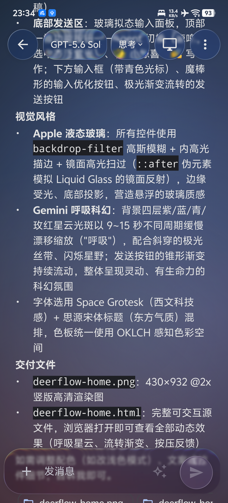
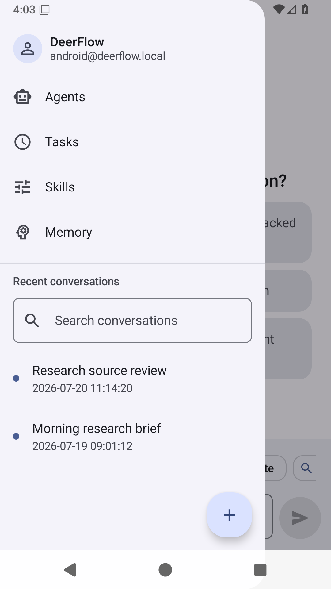
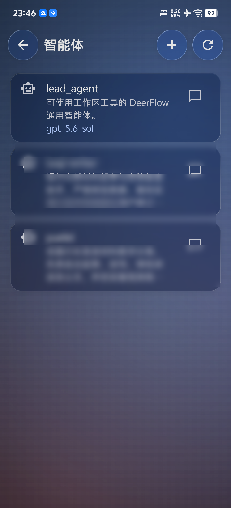
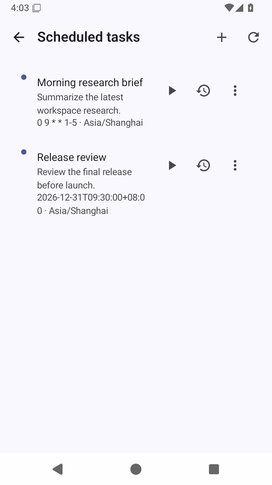
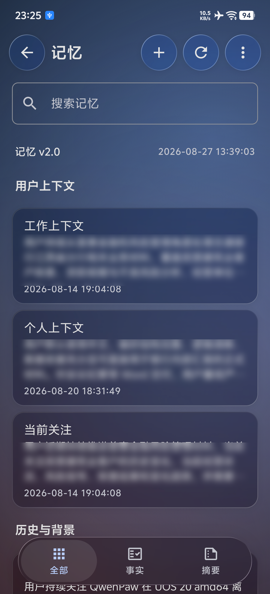
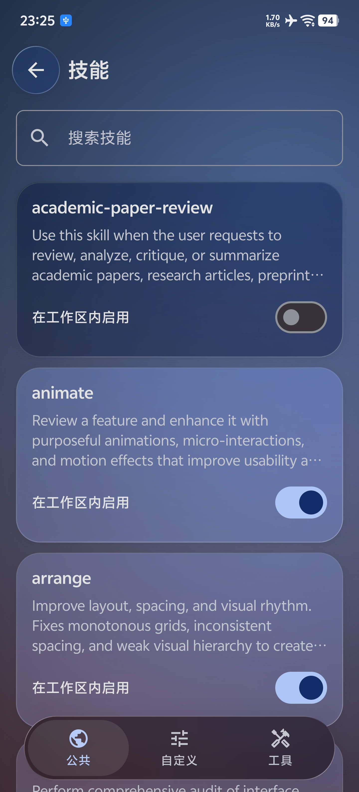
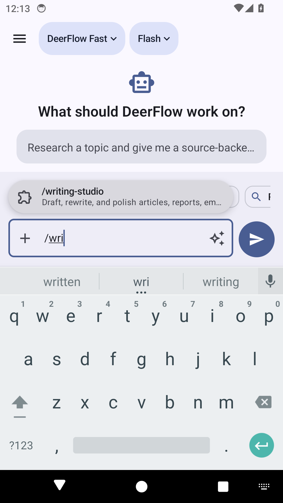
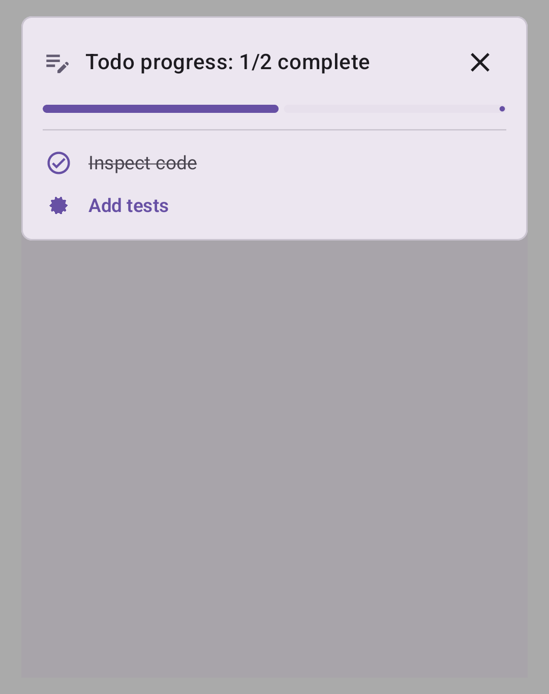
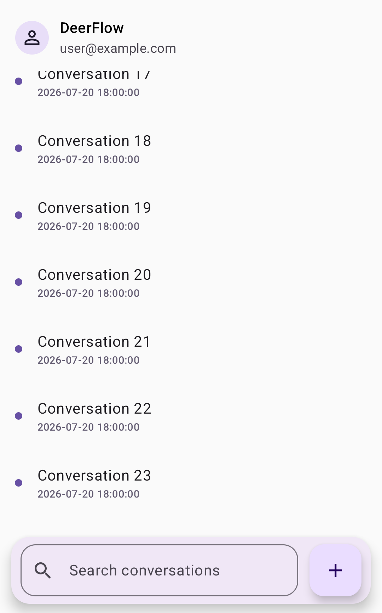
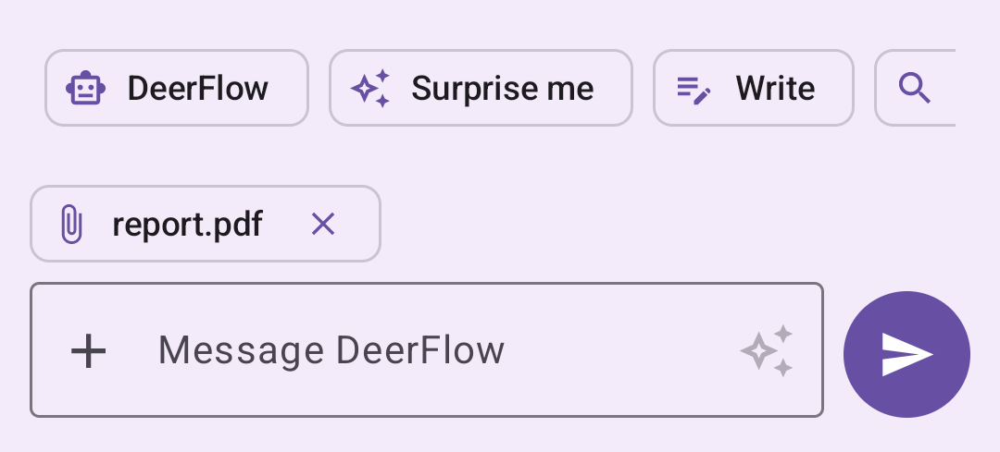

<p align="center">
  
</p>

<h1 align="center">DeerFlow Android</h1>

<p align="center">
  Native Android workspace client for a self-hosted DeerFlow Gateway.<br />
  面向自托管 DeerFlow Gateway 的原生 Android 工作区客户端。
</p>

<p align="center">
  <code>Kotlin</code> <code>Jetpack Compose</code> <code>Material 3</code> <code>Room</code> <code>API 26+</code>
</p>

<p align="center">
  <a href="https://github.com/lejw0925/deer-flow-android/releases/latest">下载最新版本</a> |
  <a href="#chinese">简体中文</a> | <a href="#english">English</a>
</p>

<a id="screenshots"></a>

## Screenshots / 运行截图

<table>
  <tr>
    <td width="25%" align="center"><br /><sub>Chat / 对话</sub></td>
    <td width="25%" align="center"><br /><sub>Workspace drawer / 工作区抽屉</sub></td>
    <td width="25%" align="center"><br /><sub>Agents / 智能体</sub></td>
    <td width="25%" align="center"><br /><sub>Scheduled tasks / 定时任务</sub></td>
  </tr>
</table>

### 2.0.0 liquid glass details / 2.0.0 液态玻璃细节

<table>
  <tr>
    <td width="50%" align="center"><br /><sub>Memory: glass cards + floating glass tabs / 记忆：玻璃卡片 + 悬浮玻璃标签栏</sub></td>
    <td width="50%" align="center"><br /><sub>Skills page with glass tabs / 技能独立页 + 玻璃标签栏</sub></td>
  </tr>
</table>

### 1.1.7 interaction details / 1.1.7 交互细节

<table>
  <tr>
    <td width="50%" align="center"><br /><sub>Slash skill search / 斜杠技能搜索</sub></td>
    <td width="50%" align="center"><br /><sub>Segmented Todo progress / Todo 分段进度</sub></td>
  </tr>
  <tr>
    <td width="50%" align="center"><br /><sub>Fixed drawer structure / 固定抽屉结构</sub></td>
    <td width="50%" align="center"><br /><sub>Compact attachment tag / 紧凑附件标签</sub></td>
  </tr>
</table>

> Screenshots were captured from a debug build running on a real device (iQOO V2520A, Android 16) connected to a self-hosted Gateway. The 1.1.7 set came from the emulator + mock Gateway.
>
> 截图来自真机（iQOO V2520A，Android 16）上的 Debug 构建，连接自托管 Gateway；1.1.7 组图来自模拟器 + Mock Gateway。

<a id="chinese"></a>

## 简体中文

### 项目简介

DeerFlow Android 是 DeerFlow 工作区的原生 Android 客户端，而不是 WebView 包装应用。它复用 DeerFlow Gateway 的公开 `/api/*` 协议，将对话、Agent、任务、记忆和工具能力带到手机与平板设备。只有 OIDC 登录会在受限 WebView 中完成身份提供商跳转。

### 主要能力

- **原生工作区体验**：Jetpack Compose 与 Material 3 Expressive 界面；手机使用会话抽屉，大屏使用常驻工作区侧栏；支持动态配色、深色模式、英文和简体中文。
- **完整的会话生命周期**：搜索、新建、重命名、置顶、删除会话，保存草稿，并可通过启动器快捷方式重新打开最近会话。
- **实时流式输出**：增量消费 `messages-tuple` SSE，并按顺序归并 LangGraph `updates` 部分补丁；支持乐观用户消息确认、取消、断线重连和恢复活动运行。
- **后台运行可见**：活动运行由应用级协调器和前台服务托管。符合条件的 Android 16 设备可显示 promoted Live Update；其他设备保留标准前台进度通知。
- **可控的运行能力**：选择模型、Agent、思考/计划/子 Agent 模式及已启用技能，并根据模型能力隐藏不支持的选项。
- **富内容与文件**：渲染 Markdown、代码块、引用来源、工具调用、审批/人工输入卡片、子任务、Todo、图片结果和附件；支持相机、照片、文档上传，以及 Artifact 预览、下载、打开和会话导出。
- **工作区管理**：管理自定义 Agent 与执行历史、周期或一次性定时任务、Memory 摘要和事实、MCP 服务器/工具，以及 Channels 运行时配置。
- **本地优先的阅读体验**：Room 缓存按服务器隔离的会话、消息、草稿、附件、运行恢复标记和工作区元数据。离线时可浏览已缓存内容，但应用不会离线排队发送提示词。

### 1.1.7 更新

- **持久的运行状态**：进行中的 Android 16 Live Update 会反映最近使用的工具；含 Todo 的运行按任务数等分进度槽并保留圆角间隔。完成后保留最终状态通知和纯文字“查看”操作，不再显示大型完成勾图，也不会自动消失。
- **会话内技能搜索**：在输入框键入 `/` 后，技能建议稳定显示在编辑器上方；可在 `/` 后继续输入，按名称或描述过滤，异步加载列表不会抢走输入焦点。技能卡片统一以启用状态显示主题色、禁用状态显示背景色。
- **更紧凑的工作区**：抽屉将 DeerFlow 与账户信息放在固定头像右侧；近期会话时间改为更小的次级色标签，搜索和新建会话固定在底部。上传文件标签同时收紧了垂直留白。
- **技能与 Agent 页面**：技能详情删除仅供下一次运行使用的启用开关，公共、自定义和工具页去除重复标题；Agent 页右侧仅保留会话操作，其余操作通过左滑菜单展开。
- **流式恢复修正**：正常重连后会正确清除诸如“Retrying 1/3”的临时状态，避免过期重试提示滞留在会话中。

### 1.1.2 更新

- **多文件回传**：助手消息中的多个产物文件收拢为单行横向列表，可左右滑动浏览并打开目标文件，避免长文件列表挤占对话空间。
- **系统分享预填草稿**：可从其他应用向 DeerFlow 分享文本或文件；应用会创建新的本地会话草稿并预填内容，保留由用户手动发送的控制权。

### 2.0.0 更新

- **液态玻璃 2.0**：全量真实采样玻璃重构——记忆/任务/智能体/设置列表卡片、底部抽屉（组合内渲染，可折射背后会话内容）、官方 LiquidBottomTabs 三层结构的悬浮玻璃标签栏（选中项透镜放大折射 + 色散），技能改为独立页面。
- **流式性能**：Markdown 流式跳过全文重解析、块解析追加快路径、RunService 同步 IPC 合帧、持久化增量 upsert、图片 LRU 缓存与降采样。
- **动效与功耗**：极光背景 144s 无缝循环 + 前台/可见性门控 + 30fps 节流（空闲 CPU 由 ~110% 降至 24-45%，后台归零）；StreaminReveal 模糊分档缓存；小玻璃按钮色散仅按压时启用。
- **阅读体验**：记忆/任务列表玻璃卡片化、记忆摘要详情、抽屉选中会话玻璃胶囊与紧凑时间戳、消息按角色重新着色。

### 1.1.1 更新

- **运行详情与审计**：会话右上角三点菜单可打开运行详情，查看最近运行、事件、LLM/Token 用量与工作区变更；浏览器实时控制入口仍保持独立。
- **飞书 / Lark 状态入口**：个人页提供安装、配置和授权状态，便于识别服务端缺失的前置条件。
- **流式与自托管兼容性**：识别重试和安全终止通知，避免对客户端 HTTP 4xx 无限重试；签名版允许连接自托管 DeerFlow Gateway 的 HTTP 地址。

### 1.1.0 更新

- **Browser Live Control**：Gateway 返回浏览器工具快照时，可从消息中打开 1280 x 720 的远程浏览器实时画面。支持地址跳转、前进/后退、标签切换、点击、拖动、滚动和文本输入；实际浏览与凭据仍保留在 Gateway 侧。
- **更完整的 Agent 运行过程**：消费自定义 SSE 任务事件，实时更新子 Agent 步骤；运行通知会反映当前工具与完成状态，支持 Android 16 Live Update 和标准前台通知回退。
- **阅读与工具呈现**：支持行内与块级 TeX 数学公式、浏览器工具预览，以及按工具类别显示的图标，便于在长会话中识别当前操作。
- **账户与通道细节**：关于页展示版本、构建号、包名、源码与许可证；通道 API 的 JSON 空值不会再以可见的 `null` 文本显示。

### 技术架构

| 层级 | 位置 | 职责 |
| --- | --- | --- |
| UI | `app/src/main/java/com/deerflow/mobile/ui/` | Compose 屏幕、导航、主题、展示逻辑与 ViewModel |
| 运行 | `app/src/main/java/com/deerflow/mobile/run/` | SSE 生命周期、重连、恢复、前台服务与通知 |
| 数据 | `app/src/main/java/com/deerflow/mobile/data/` | Gateway API、认证 Cookie、Room、DataStore、缓存与协议归并 |
| 资源 | `app/src/main/res/` | 图标、字符串、主题、网络安全配置与快捷方式 |
| 测试夹具 | `tools/mock_gateway.py` | 本地 Gateway、SSE 与工作区能力演示服务 |

核心依赖包括 Kotlin、Jetpack Compose、Material 3、OkHttp、Retrofit、Room、DataStore、CommonMark 和 Kotlin Coroutines。数据库迁移 schema 存放在 `app/schemas/`。

### 第三方库 / Third-party libraries

| 库 / Library | 用途 / Purpose | 许可 / License |
| --- | --- | --- |
| [Kyant0/AndroidLiquidGlass](https://github.com/Kyant0/AndroidLiquidGlass) (`io.github.kyant0:backdrop:1.0.6`) | 液态玻璃渲染基座：backdrop 录制/采样、blur、vibrancy、lens（AGSL）。`ui/glass/` 的整套玻璃系统与悬浮标签栏基于它构建 | Apache-2.0 |
| [mikepenz/multiplatform-markdown-renderer](https://github.com/mikepenz/multiplatform-markdown-renderer) (`com.mikepenz:multiplatform-markdown-renderer-m3/code:0.28.0`) | 会话 Markdown 的增强渲染（代码块、表格） | Apache-2.0 |
| [commonmark-java](https://github.com/commonmark/commonmark-java) (`org.commonmark:commonmark:*:0.29.0`) | Markdown 解析（GFM 删除线/表格扩展）、引用来源提取 | BSD-2-Clause |
| [RaTeX](https://github.com/erweixin/RaTeX) (`io.github.erweixin:ratex-android:0.1.13`) | 行内与块级 LaTeX 数学公式渲染 | 见上游仓库 |
| [OkHttp](https://github.com/square/okhttp) / [Retrofit](https://github.com/square/retrofit) | Gateway HTTP 与 SSE 通信 | Apache-2.0 |
| [AndroidX Jetpack](https://developer.android.com/jetpack)（Compose、Material 3 Expressive、Room、DataStore、Lifecycle、Navigation） | UI 框架、持久化与生命周期 | Apache-2.0 |
| Kotlin / kotlinx.coroutines | 语言与并发 | Apache-2.0 |

数据库迁移 schema 存放在 `app/schemas/`。各依赖的完整许可文本可在应用内「我的 → 关于 → 开源许可」查看。

### 环境要求

- Android 8.0 及以上，最低 API 26
- JDK 17
- Android SDK 36，用于编译
- 可访问的 DeerFlow Gateway；模拟器默认可通过 `http://10.0.2.2:2026` 访问宿主机的 `2026` 端口

### 快速开始

1. 克隆仓库并进入目录。
2. 使用 JDK 17 运行完整的本地质量门禁：

```bash
JAVA_HOME=/usr/lib/jvm/java-17-openjdk-amd64 \
  ./gradlew testDebugUnitTest lintDebug assembleDebug assembleDebugAndroidTest \
  --no-daemon --console=plain
```

3. Debug APK 位于 `app/build/outputs/apk/debug/app-debug.apk`。连接 Android 设备或模拟器后安装：

```bash
JAVA_HOME=/usr/lib/jvm/java-17-openjdk-amd64 \
  ./gradlew :app:installDebug --no-daemon --console=plain
```

4. 在登录页填写 Gateway 的**站点根地址**，例如 `https://deerflow.example.com`。不要在地址后添加 `/api` 或 `/api/langgraph`。

### 安装正式版本

发布版本可从 [GitHub Releases](https://github.com/lejw0925/deer-flow-android/releases/latest) 下载 `app-release.apk`。在 Android 的安装确认页完成安装后，首次打开时填写 Gateway 的站点根地址即可。Release 包启用压缩与优化，并只允许生产 Gateway 的 HTTPS 连接（`localhost` 与模拟器 `10.0.2.2` 除外）。

### 使用本地 Mock Gateway

无需部署 DeerFlow 即可查看界面和流式交互。先在仓库根目录启动夹具：

```bash
python3 tools/mock_gateway.py --port 2027
```

然后在 Android 模拟器中填写 `http://10.0.2.2:2027`，使用任意非空邮箱和密码登录。夹具提供对话、流式响应、Agent、执行历史、定时任务、Memory、MCP 和 Artifact 的示例响应，仅供本地开发和测试使用。

### 连接生产 Gateway

- 生产环境使用 HTTPS 和 DeerFlow 认证；Debug 构建为了局域网和模拟器调试允许受控的 HTTP，Release 构建仅对 `localhost` 和 `10.0.2.2` 保留例外。
- 本地账号登录、Gateway 配置的 OIDC SSO 和关闭认证的 Gateway 会话均受支持。会话与 CSRF Cookie 使用 Android 系统 Cookie 存储，应用不会把凭据或访问令牌写进 Room 缓存。
- 客户端使用 DeerFlow 的认证、线程状态、运行流、模型、Agent、技能、任务、记忆和工具接口。Gateway 能力决定部分管理功能是否可用。

### 测试

运行单个 JVM 测试：

```bash
JAVA_HOME=/usr/lib/jvm/java-17-openjdk-amd64 \
  ./gradlew :app:testDebugUnitTest \
  --tests 'com.deerflow.mobile.data.SseParserTest' \
  --no-daemon --console=plain
```

运行设备测试时请明确选择模拟器：

```bash
ANDROID_SERIAL=emulator-5554 \
  ./gradlew connectedDebugAndroidTest --no-daemon --console=plain
```

测试覆盖 SSE 解析和状态归并、缓存/Room 迁移、Gateway 合约、会话控制、可访问性与 Compose 界面。`WorkspaceScreenshotTest` 会在多种手机、折叠屏、平板、语言、主题和字号场景下校验视觉基线。

### Release 签名

构建可分发 Release 前，必须通过 Gradle 属性、环境变量或 `keystore.properties` 配置以下四项：

```text
DEERFLOW_RELEASE_STORE_FILE
DEERFLOW_RELEASE_STORE_PASSWORD
DEERFLOW_RELEASE_KEY_ALIAS
DEERFLOW_RELEASE_KEY_PASSWORD
```

未完整配置时，`assembleRelease` 会生成仅用于本地校验、使用 AGP Debug 证书签名的 APK。该 APK 不能分发。

### 贡献约定

- 生产代码按 `data/`、`run/`、`ui/` 分层，Compose 屏幕不要直接调用 Retrofit 或 Room。
- 变更 SSE、缓存、迁移或 Gateway 协议时，请添加聚焦回归测试并先运行相关测试，再运行完整构建命令。
- 不要提交 `local.properties`、`keystore.properties`、账号凭据或发布签名材料。

<a id="english"></a>

## English

### Overview

DeerFlow Android is the native Android workspace client for DeerFlow, not a WebView wrapper. It reuses the public DeerFlow Gateway `/api/*` contracts to bring conversations, Agents, tasks, memory, and tools to phones and tablets. The restricted WebView is used only for OIDC identity-provider redirects.

### Highlights

- **Native workspace UI**: Jetpack Compose and Material 3 Expressive, with a conversation drawer on phones and a persistent workspace rail on large screens. Dynamic color, dark mode, English, and Simplified Chinese are supported.
- **Full conversation lifecycle**: Search, create, rename, pin, delete, restore drafts, and reopen recent conversations from launcher shortcuts.
- **Streaming that preserves state**: Incremental `messages-tuple` SSE rendering and ordered LangGraph `updates` patch reduction, with optimistic-message acknowledgement, cancellation, reconnect, and active-run recovery.
- **Visible background work**: An application-level coordinator and foreground service own active runs. Eligible Android 16 devices can use promoted Live Updates; other devices retain a standard foreground progress notification.
- **Run controls**: Choose models, Agents, thinking/plan/subagent modes, and enabled skills. Unsupported controls are filtered by model capability.
- **Rich output and files**: Markdown, code blocks, citations, tool calls, approval and human-input cards, subtasks, Todo state, image results, attachments, Artifact preview/download/open, camera/photo/document upload, and conversation export.
- **Workspace management**: Manage custom Agents and their execution history, cron or one-time tasks, memory summaries and facts, MCP servers/tools, and Channels runtime configuration.
- **Offline reading without surprise sends**: Room caches server-scoped conversations, messages, drafts, attachments, run markers, and workspace metadata. Cached content remains readable offline, but prompts are never queued for later transmission.

### What's New in 1.1.7

- **Durable run state**: Active Android 16 Live Updates reflect the most recently used tool; runs with Todos use equal task-count progress segments with rounded gaps. On completion, the final notification remains available with a text-only View action, no large completion artwork, and no automatic dismissal.
- **In-conversation skill search**: Type `/` in the composer to show stable suggestions above it, then continue typing to filter by skill name or description without async loading stealing input focus. Skill cards consistently use the theme color when enabled and the background color when disabled.
- **A tighter workspace**: The drawer places DeerFlow and the account beside the fixed avatar; recent timestamps are smaller and secondary-colored, while search and new conversation stay fixed at the bottom. Uploaded-file tags also have tighter vertical spacing.
- **Skill and Agent surfaces**: Skill details no longer expose a per-next-run enable control, and duplicate headings are removed from Public, Custom, and Tools. The Agent screen keeps only the conversation action on the right, with other actions available from a swipe-left menu.
- **Streaming recovery fix**: A normal reconnection now clears temporary states such as `Retrying 1/3`, preventing stale retry text from remaining in a conversation.

### What's New in 1.1.2

- **Returned files**: Multiple artifacts in an assistant message now share one horizontally scrollable row, keeping long file lists compact while preserving direct open actions.
- **System-share drafts**: Share text or files to DeerFlow from another app to create a new local conversation draft with the content prefilled; nothing is sent until the user chooses to send it.

### What's New in 1.1.1

- **Run details and audit**: The conversation overflow menu opens run details for recent runs, events, LLM/token usage, and workspace changes. Browser Live Control remains a dedicated action.
- **Lark status entry point**: Profile exposes installation, configuration, and authorization status so server-side prerequisites are clear.
- **Streaming and self-hosted compatibility**: Retry and safety-termination notices are surfaced, client HTTP 4xx responses no longer retry indefinitely, and the signed build can reach self-hosted DeerFlow Gateway HTTP origins.

### What's New in 1.1.0

- **Browser Live Control**: When the Gateway returns a browser-tool snapshot, open a 1280 x 720 remote browser view directly from the message. Address navigation, back/forward, tab selection, tap, drag, scroll, and text input are supported while the actual browsing session and credentials remain on the Gateway.
- **More complete Agent progress**: Custom SSE task events update subagent steps as they happen. Run notifications reflect the active tool and terminal state, with Android 16 Live Updates and a standard foreground-notification fallback.
- **Reading and tool presentation**: Inline and display TeX math, browser-tool previews, and tool-specific icons make long-running conversations easier to follow.
- **Account and channel details**: The About screen shows version, build, package name, source, and license. JSON null values from the Channels API are no longer rendered as visible `null` text.

### Architecture

| Layer | Location | Responsibility |
| --- | --- | --- |
| UI | `app/src/main/java/com/deerflow/mobile/ui/` | Compose screens, navigation, theming, presentation, and ViewModel state |
| Run | `app/src/main/java/com/deerflow/mobile/run/` | SSE lifecycle, reconnect/recovery, foreground service, and notifications |
| Data | `app/src/main/java/com/deerflow/mobile/data/` | Gateway API, auth cookies, Room, DataStore, caching, and protocol reduction |
| Resources | `app/src/main/res/` | Icons, strings, themes, network configuration, and shortcuts |
| Test fixture | `tools/mock_gateway.py` | Local Gateway fixture for UI, SSE, and workspace capability testing |

The client uses Kotlin, Jetpack Compose, Material 3, OkHttp, Retrofit, Room, DataStore, CommonMark, and Kotlin Coroutines. Checked-in Room migration schemas live in `app/schemas/`.

### Requirements

- Android 8.0 or later, API 26 minimum
- JDK 17
- Android SDK 36 for compilation
- An accessible DeerFlow Gateway. The emulator default `http://10.0.2.2:2026` reaches port `2026` on the development host.

### Quick Start

1. Clone the repository and enter it.
2. Run the complete local verification gate with JDK 17:

```bash
JAVA_HOME=/usr/lib/jvm/java-17-openjdk-amd64 \
  ./gradlew testDebugUnitTest lintDebug assembleDebug assembleDebugAndroidTest \
  --no-daemon --console=plain
```

3. The debug APK is written to `app/build/outputs/apk/debug/app-debug.apk`. Install it on a connected device or emulator:

```bash
JAVA_HOME=/usr/lib/jvm/java-17-openjdk-amd64 \
  ./gradlew :app:installDebug --no-daemon --console=plain
```

4. On the login screen, enter the Gateway's **origin**, such as `https://deerflow.example.com`. Do not append `/api` or `/api/langgraph`.

### Install a Release

Download `app-release.apk` from [GitHub Releases](https://github.com/lejw0925/deer-flow-android/releases/latest). Complete Android's install confirmation, then enter the Gateway origin on first launch. Release packages are optimized and only allow production Gateway HTTPS connections, apart from the `localhost` and emulator `10.0.2.2` development exceptions.

### Local Mock Gateway

You can inspect the UI and streaming flow without deploying DeerFlow. Start the fixture from the repository root:

```bash
python3 tools/mock_gateway.py --port 2027
```

Then enter `http://10.0.2.2:2027` in an Android emulator and sign in with any non-empty email and password. The fixture supplies example conversations, streams, Agents, execution history, scheduled tasks, memory, MCP, and Artifacts. It is intended only for local development and testing.

### Production Gateway Notes

- Use HTTPS and DeerFlow authentication in production. Debug builds permit controlled HTTP for LAN and emulator work; Release builds only keep exceptions for `localhost` and `10.0.2.2`.
- Local-account login, Gateway-configured OIDC SSO, and auth-disabled Gateway sessions are supported. Session and CSRF cookies use Android's system cookie store. Credentials and access tokens are not written to the Room cache.
- The client consumes DeerFlow authentication, thread/state, run-stream, model, Agent, skill, task, memory, and tool endpoints. Gateway capabilities determine whether some management surfaces are available.

### Tests

Run a focused JVM test:

```bash
JAVA_HOME=/usr/lib/jvm/java-17-openjdk-amd64 \
  ./gradlew :app:testDebugUnitTest \
  --tests 'com.deerflow.mobile.data.SseParserTest' \
  --no-daemon --console=plain
```

Select the emulator explicitly for device tests:

```bash
ANDROID_SERIAL=emulator-5554 \
  ./gradlew connectedDebugAndroidTest --no-daemon --console=plain
```

The suite covers SSE parsing and state reduction, cache/Room migrations, Gateway contracts, conversation controls, accessibility, and Compose UI. `WorkspaceScreenshotTest` validates visual baselines across phone, foldable, tablet, locale, theme, and font-scale scenarios.

### Release Signing

Before producing a distributable Release build, configure all four values through Gradle properties, environment variables, or `keystore.properties`:

```text
DEERFLOW_RELEASE_STORE_FILE
DEERFLOW_RELEASE_STORE_PASSWORD
DEERFLOW_RELEASE_KEY_ALIAS
DEERFLOW_RELEASE_KEY_PASSWORD
```

Without all four values, `assembleRelease` creates a local-validation APK signed with the AGP debug certificate. It must not be distributed.

### Contribution Notes

- Keep production code in the `data/`, `run/`, and `ui/` layers. Compose screens must not call Retrofit or Room directly.
- Changes to SSE, caching, migrations, or Gateway contracts need focused regression coverage, followed by the full build command.
- Never commit `local.properties`, `keystore.properties`, credentials, or release-signing material.
